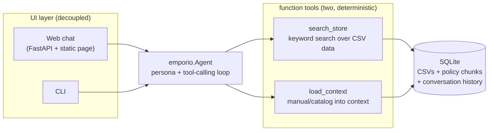

# AI customer-service agent for Empório da Música

Artefact **AI Engineer – Full-Stack** technical case. A WhatsApp-style
customer-service agent for *Empório da Música*, a musical-instrument store in
Campo Grande/MS. It answers catalog, order and store-policy questions by
**calling tools against real data** - it never quotes a price, a stock count
or a return policy from memory.




## Quickstart

Requirements: Python ≥ 3.11, [uv](https://docs.astral.sh/uv/), an OpenAI API key.

```bash
# 1. install (all Python lives in api/ - run everything from there)
cd api
uv sync

# 2. configure the model provider
cp .env.example .env        # then edit: OPENAI_API_KEY=sk-...
                            # OPENAI_MODEL is optional (default: gpt-4o-mini)

# 3. build the database (CSVs + policy PDF -> data/emporio.db)
uv run scripts/build_db.py

# 4. run the agent: web chat at http://localhost:8080
uv run uvicorn app.server:app --port 8080

# tests (offline - no API key needed)
uv run pytest tests/ -q
```

There is also a terminal client (`uv run python cli.py`) if you prefer a CLI; the
web chat above is the intended way to interact with the agent.

Example conversations live in [`api/conversations/`](api/conversations/).

## Architecture and decisions

The case asks for a messaging agent that *knows when to consult data and when
to consult policies*. The agent has exactly two tools, one per retrieval mode,
and both are deterministic - no embeddings, no cosine similarity, no top-k
guesswork:

- `search_store` - keyword retrieval over the CSV-derived SQLite (FTS5 plus
  typed price/stock filters). It auto-detects what is being searched:
  product or category, phone, e-mail, order number, tracking code or
  customer name.
- `load_context` - context loading, Anthropic style: the policy manual whole
  or by full section, the full product index (every name, category and
  effective price, so the model searches with the right key), or the active
  promotions. Content lands verbatim in the context window instead of being
  ranked.

### Agent approach - native function calling over a tool layer (hybrid)

Chosen over the alternatives the case lists:

| Option | Why not (alone) |
|---|---|
| **Text-to-SQL agent** (free SQL generation) | The catalog questions are enumerable (search, price, order status). Parameterized tools give deterministic, testable queries; free-form SQL adds injection/format risk for zero user-visible gain at this catalog size. |
| **ReAct via prompt** (model writes "Action: ...") | OpenAI-style native tool calling does the same planning loop with schema validation and structured dispatch - more reliable, less prompt scaffolding. |
| **Pure RAG** (dump everything in context) | Prices/stock must be *exact and current*; prose retrieval can't guarantee that, and the manual itself forbids quoting prices without checking the system (§7.1). Context loading is still the right call for the 8-page manual - that's exactly what `load_context` does. |

The loop (`emporio/agent.py`) is deliberately small: replay persisted history →
call the model with tool schemas → execute tool calls → feed results back →
repeat up to a bound → persist the final reply.

### Model and provider - OpenAI `gpt-4o-mini`

Cheap, fast, and reliable at Portuguese + tool calling - the workload here is
short turns with structured tool output, not deep reasoning. The model is a
config value (`OPENAI_MODEL`), so swapping providers is a one-line change; the
tests run against a scripted client, so they don't depend on any provider.

### Manual: context loading, not ranking

The manual is 8 pages, so it fits in the context window. `load_context`
returns whole sections - matched deterministically by number (`"4"`, `"4.2"`,
children included) or by keyword over title *and* body with accents folded -
and when a keyword misses, the returned `secoes_disponiveis` plus a prompt
rule make the model load the entire manual and answer from it.

The first implementation was BM25 chunk ranking (top-4). It was replaced: a
top-k cut can drop the sentence that decides the answer, and keyword-in-title
matching alone missed the store address living in the body of section 1.
Loading the full section beats guessing the chunk.

No embeddings or cosine similarity anywhere: for this corpus they would add
an API dependency, cost and non-determinism to solve a problem the document
doesn't have (small, well-sectioned). Every retrieval path here is
deterministic and testable offline.

### Structured data - CSVs → typed SQLite, prices always "effective"

`api/scripts/build_db.py` is a small ETL: typed columns, one canonical DB file.
Product results always carry the **best active promotion** (original price +
discount % + promo price together) so the agent can follow manual §6.2
(promotional prices must be shown with the original price and discount) by
construction, not by prompt hope. Order lookups support id, tracking code, or
customer identification by phone (digit-normalized) / e-mail / name.

One design rule learned the hard way (see the test suite): **policy deadline
math is computed by the tool, never by the model.** Every order returned by
`search_store` carries a ready-made `deadlines` object - dates,
`..._expired` flags and a `caminho_sugerido` with the next valid path per
manual §4 - because a gpt-4o-mini asked to "compare dates" happily claimed a
February delivery was still inside a 7-day window in September. Deterministic
reasoning belongs in Python; the LLM phrases it.

### Interfaces - decoupled by contract

`emporio.Agent.chat(session_id, message) -> reply` is the entire public API.
The web UI and the CLI import nothing else from the package - the agent module
has zero knowledge of HTTP or terminals. The split is physical: the Python
side lives in `api/`, the chat page is a single static HTML file in
`interface/` (no build step), styled as the store's WhatsApp channel, which is
the scenario the manual itself describes (§7).

### Conversation persistence - SQLite, transcripts only

`sessions`/`messages` tables in the same DB; the last 24 messages are replayed
per turn. Tool exchanges live only inside a turn (kept out of the transcript),
which keeps stored conversations clean, reviewable and cheap to reload.

### Persona and prompt strategy

The persona follows the manual's own service guidelines: informal but
professional, "a friend who understands music" (§7.1), WhatsApp-length replies.
The system prompt carries only *identity and rules* (scope: instruments only -
accessory requests get redirected; mandatory tool check before any
price/stock/delivery/policy claim; promo transparency; PII masking; friendly
deflection of off-topic chat). All facts come from tools. The store-timezone
**date is injected per turn**, because return/exchange windows (§4) are
deadline math against order dates.

## Assumptions (the case invites documenting them)

1. **Language**: the agent converses in PT-BR (Brazilian store, Brazilian
   customers - the manual defines the tone in Portuguese); this README is in
   English per the application instructions.
2. **"Today" vs dataset dates**: orders are dated 2025–2026. The agent computes
   policy deadlines against the real current date - e.g. a *right of
   repentance* request on an old order honestly comes back as expired, with
   the next valid path offered (warranty/fabricante). Conversation 4 in
   [`api/conversations/`](api/conversations/) shows this end-to-end.
3. **Customer identity**: a WhatsApp number or name is enough to locate a
   registered customer; when names collide, the agent confirms the city before
   discussing orders. Contact data is masked in tool output (LGPD §9).
4. **Accessories** (strings, picks, cables, pedals, amps, cases) are
   out-of-scope *by store policy* - redirected politely, never "sold".
5. **Promotions** are read from `promotions.csv` with `is_active=1` only;
   expired promotions are answered with the current price (§7.3).

## Known limitations (and what I'd do with more time)

- **Keyword section matching** can miss heavy paraphrases ("atrasado" vs
  "prazo de entrega"); the full-manual fallback covers the answer but costs
  a bigger context. Next step: an eval set of paraphrased policy questions
  to measure whether this path needs anything smarter than load-whole.
- **No conversation evaluation harness.** I'd add a regression set of scripted
  customer journeys (assert tool calls + facts in the reply) run on every PR.
- **Single SQLite connection guarded by a lock** - fine for a demo, not for
  concurrent production traffic; would move to a pool + per-request
  connections (or Postgres) and keep the same `store.py` interface.
- **No streaming** - replies arrive whole; WhatsApp-style typing would feel
  better with token streaming (SSE).
- **No real escalation flow** - complaints are answered with the 24h-return
  promise (§7.3), but there is no human-handoff queue behind it.
- **Model fallback not implemented** - a provider outage returns the generic
  error message; retries/backoff would be next.
- **Auth-free HTTP endpoints** - demo scope; a real deployment needs at least
  per-session tokens.

## Use of AI coding assistants

I built this project pairing with an **AI coding agent (GLM, in the Oh My Pi
harness)** - the workflow was:

- I read the case and the policy manual, chose the architecture (hybrid
  function calling: deterministic keyword search plus context loading, no
  similarity ranking), and specified the module boundaries
  (agent library strictly decoupled from the UIs).
- The agent wrote code under my direction, in small verifiable steps:
  ETL → retrieval → agent loop → interfaces → tests. Every step was run and
  reviewed by me before being committed - the git history reflects the real
  sequence, including bugs caught along the way by smoke tests and by the
  test suite (e.g. a wrong timezone import and an ETL column mapping that
  silently emptied the product search index).
- Conversations with the agent, the README narrative and all judgment calls
  (persona rules mapped to manual sections, assumptions above) are mine;
  the AI accelerated the typing, not the decisions.

This is disclosed here because the case asks for the workflow - and because
reviewing AI-generated code critically (including rejecting and rewriting
parts of it) is, I believe, exactly the skill this role should exercise.

## Repository layout

```
├── api/                        # the Python side: agent, data, tests
│   ├── app/server.py           # FastAPI (thin: chat + reset + index)
│   ├── src/emporio/
│   │   ├── agent.py            # tool-calling loop (public API: Agent)
│   │   ├── tools.py            # two tool schemas + dispatch
│   │   ├── prompts.py          # system prompt: persona + rules
│   │   ├── store.py            # SQLite: schema, ETL, catalog/order queries
│   │   ├── policies.py         # policy PDF → sections loaded into context
│   │   ├── session.py          # conversation persistence
│   │   └── config.py           # env/paths
│   ├── scripts/build_db.py     # CSVs + PDF → data/emporio.db
│   ├── cli.py                  # terminal client
│   ├── tests/                  # offline suite (scripted LLM client)
│   ├── conversations/          # example interactions (case deliverable)
│   └── data/                   # case-provided sources (CSVs + policy PDF)
└── interface/
    ├── index.html              # WhatsApp-style chat page (single file)
    └── docs/screenshot.png     # the web chat in action
```
