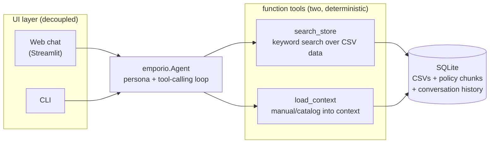
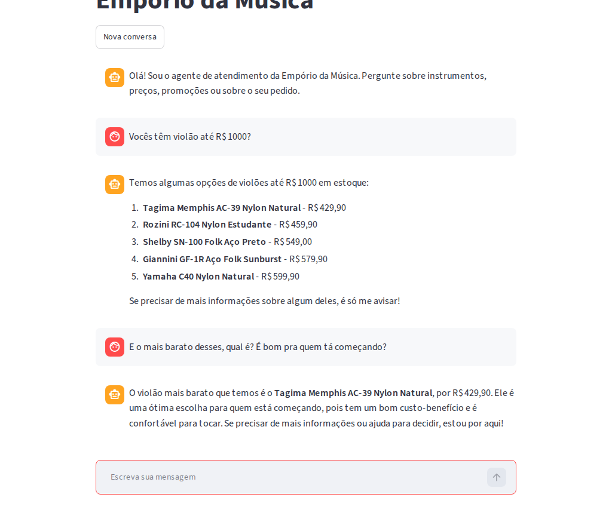

# AI customer-service agent for Empório da Música





## Quickstart

Requirements: Python ≥ 3.11, [uv](https://docs.astral.sh/uv/), an OpenAI API key.

```bash
# 1. install and configure (one time)
cd api
uv sync
cp .env.example .env        # then edit: OPENAI_API_KEY=sk-...
                            # OPENAI_MODEL is optional (default: gpt-4o)
uv run scripts/build_db.py  # CSVs + policy PDF -> data/emporio.db
```

```bash
# 2. terminal 1 - the API (leave it running)
cd api
uv run uvicorn app.server:app --port 8080
```

```bash
# 3. terminal 2 - the web chat, opens at http://localhost:8501
cd api
uv run --group ui streamlit run ../interface/app.py
```

The two terminals must both stay running: the web chat talks to the API on
port 8080 (if the chat replies that it cannot reach the server, terminal 1 is
not running). The command path ends in `app.py` - if streamlit complains that
the file has no extension, a stray character slipped into the pasted command.

```bash
# tests (offline - no API key needed)
cd api
uv run pytest tests/ -q
```

There is also a terminal client (`uv run python cli.py`) if you prefer a CLI; the
web chat above is the intended way to interact with the agent.

Example conversations live in [`conversations/`](conversations/).

## Case requirements coverage

The case specifies four agent capabilities; each maps directly to a concrete implementation decision:

| Requirement | Implementation |
|---|---|
| **Persona aligned with the store's identity and tone** | System prompt (`api/src/emporio/prompts.py`) defines the agent as an informal but professional virtual attendant following the store's own service manual: WhatsApp-length replies, calling the customer by name, redirecting accessories, escalating complaints with empathy (§7.1, §7.3). Tone is baked into rules, not left to model defaults. |
| **Respond based on available context** | The last 24 turns of each session are replayed in full at every call. Tool results land verbatim in the context window. The model never needs to recall a fact it was not explicitly given this turn. |
| **Know when to consult data** | `search_store` covers every data question: product price/stock, order status, customer lookup, active promotions. A prompt rule makes it mandatory before any factual claim - the model cannot quote a price from memory. |
| **Know when to consult policies** | `load_context` retrieves the policy manual by section number or keyword, or loads it whole when no section matches. A second prompt rule makes it mandatory for any policy answer (exchanges, returns, payment, hours, delivery). |
| **Handle out-of-scope questions** | Rule 5 in the system prompt: off-domain requests (sport, weather, general chat) get a one-sentence friendly refusal and a redirect. Accessory requests (strings, picks, cables) are redirected by store policy, not by improvisation. The designed failure mode is graceful refusal. |

Example conversations covering all five paths live in [`conversations/`](conversations/).

## Technical Decisions

The architectural choices of the project follow the rationale below:

| Decision | Rationale |
|---|---|
| **Framework(s) / agent approach** | Native function calling (hybrid) with two deterministic tools (`search_store` and `load_context`). Good architecture solves the problem with minimal complexity. A traditional relational database (SQLite + FTS5) coupled with function calling is vastly superior for e-commerce than forcing a vector database just for the trend. Looking up prices, tracking codes, or exact product names is structured data. If a customer searches for "Takamine GD20", FTS5 nails the exact match, whereas an embedding search might incorrectly prioritize a "Giannini" simply because its description is semantically closer to the user's phrasing. This is a mature, professional, fast, and highly deterministic engineering decision. |
| **Model and Provider** | OpenAI `gpt-4o` via API. Excellent cost-benefit, fast, and extremely reliable for structured tool calls and short replies in PT-BR. Configured via environment variable, allowing easy swapping. |
| **Interaction interface** | Simple UI via **Streamlit** (web chat) and a secondary CLI. The architecture is fully **decoupled**: the agent logic runs on a FastAPI server and Streamlit simply consumes HTTP JSON endpoints, simulating the real contract of a backend serving WhatsApp or a mobile app. |
| **Conversation history persistence** | Implemented via **SQLite** (`session.py`). Maintains the history of the latest interactions in the session, saving only the clean transcript (hiding internal tool calls) so the context sent to the LLM remains light, fast, and coherent throughout the conversation. |
| **Data treatment** | A Python ETL script converts the 6 CSVs into a typed database with **FTS5** (full-text search). A critical treatment decision: **deadline calculations and policy expirations are done in Python**, never by the model (LLMs fail at date arithmetic). Order results already embed whether they are within the deadline. Prices are served already crossing active discounts. |

### Additional details

Below are in-depth details on the implementation of tools and tests.

### Manual: context loading, not ranking

The manual is 8 pages, so it fits in the context window. `load_context`
returns whole sections - matched deterministically by number (`"4"`, `"4.2"`,
children included) or by keyword over title *and* body with accents folded -
and when a keyword misses, the returned `secoes_disponiveis` plus a prompt
rule make the model load the entire manual and answer from it.

The first implementation was BM25 chunk ranking (top-4). It was replaced: a
top-k cut can drop the sentence that decides the answer, and keyword-in-title
matching alone missed the store address living in the body of section 1.
Loading the full section beats guessing the chunk.

No embeddings or cosine similarity anywhere: for this corpus they would add
an API dependency, cost and non-determinism to solve a problem the document
doesn't have (small, well-sectioned). Every retrieval path here is
deterministic and testable offline.

### Structured data - CSVs → typed SQLite, prices always "effective"

`api/scripts/build_db.py` is a small ETL: typed columns, one canonical DB file.
Product results always carry the **best active promotion** (original price +
discount % + promo price together) so the agent can follow manual §6.2
(promotional prices must be shown with the original price and discount) by
construction, not by prompt hope. Order lookups support id, tracking code, or
customer identification by phone (digit-normalized) / e-mail / name.

One design rule learned the hard way (see the test suite): **policy deadline
math is computed by the tool, never by the model.** Every order returned by
`search_store` carries a ready-made `deadlines` object - dates,
`..._expired` flags and a `caminho_sugerido` with the next valid path per
manual §4 - because a gpt-4o asked to "compare dates" happily claimed a
February delivery was still inside a 7-day window in September. Deterministic
reasoning belongs in Python; the LLM phrases it.

### Interfaces - decoupled by contract

The web UI and the CLI import nothing from the package - the agent module has
zero knowledge of Streamlit or terminals. The split is physical: the Python
side lives in `api/` (FastAPI exposing `/api/chat` and `/api/reset` as JSON),
and `interface/app.py` is a Streamlit chat that talks to the API over HTTP
only - the same contract any other client (mobile app, WhatsApp bridge) would
use.

### Conversation persistence - SQLite, transcripts only

`sessions`/`messages` tables in the same DB; the last 24 messages are replayed
per turn. Tool exchanges live only inside a turn (kept out of the transcript),
which keeps stored conversations clean, reviewable and cheap to reload.

### Persona and prompt strategy

The persona follows the manual's own service guidelines: informal but
professional, "a friend who understands music" (§7.1), WhatsApp-length replies.
The system prompt carries only *identity and rules* (scope: instruments only -
accessory requests get redirected; mandatory tool check before any
price/stock/delivery/policy claim; promo transparency; PII masking; friendly
deflection of off-topic chat). All facts come from tools. The store-timezone
**date is injected per turn**, because return/exchange windows (§4) are
deadline math against order dates.

## Assumptions (the case invites documenting them)

1. **Language**: the agent converses in PT-BR (Brazilian store, Brazilian
   customers - the manual defines the tone in Portuguese); this README is in
   English per the application instructions.
2. **"Today" vs dataset dates**: orders are dated 2025–2026. The agent computes
   policy deadlines against the real current date - e.g. a *right of
   repentance* request on an old order honestly comes back as expired, with
   the next valid path offered (warranty/fabricante). Conversation 4 in
   [`conversations/`](conversations/) shows this end-to-end.
3. **Customer identity**: a WhatsApp number or name is enough to locate a
   registered customer; when names collide, the agent confirms the city before
   discussing orders. Contact data is masked in tool output (LGPD §9).
4. **Accessories** (strings, picks, cables, pedals, amps, cases) are
   out-of-scope *by store policy* - redirected politely, never "sold".
5. **Promotions** are read from `promotions.csv` with `is_active=1` only;
   expired promotions are answered with the current price (§7.3).

## Known limitations (and what I'd do with more time)

- **Keyword section matching** can miss heavy paraphrases ("atrasado" vs
  "prazo de entrega"); the full-manual fallback covers the answer but costs
  a bigger context. Next step: an eval set of paraphrased policy questions
  to measure whether this path needs anything smarter than load-whole.
- **No conversation evaluation harness.** I'd add a regression set of scripted
  customer journeys (assert tool calls + facts in the reply) run on every PR.
- **Single SQLite connection guarded by a lock** - fine for a demo, not for
  concurrent production traffic; would move to a pool + per-request
  connections (or Postgres) and keep the same `store.py` interface.
- **No streaming** - replies arrive whole; WhatsApp-style typing would feel
  better with token streaming (SSE).
- **No real escalation flow** - complaints are answered with the 24h-return
  promise (§7.3), but there is no human-handoff queue behind it.
- **Model fallback not implemented** - a provider outage returns the generic
  error message; retries/backoff would be next.
- **Auth-free HTTP endpoints** - demo scope; a real deployment needs at least
  per-session tokens.

## Use of AI coding assistants

I built this project pairing with an **AI coding agent (GLM, in the Oh My Pi
harness)** - the workflow was:

- I read the case and the policy manual, chose the architecture (hybrid
  function calling: deterministic keyword search plus context loading, no
  similarity ranking), and specified the module boundaries
  (agent library strictly decoupled from the UIs).
- The agent wrote code under my direction, in small verifiable steps:
  ETL → retrieval → agent loop → interfaces → tests. Every step was run and
  reviewed by me before being committed - the git history reflects the real
  sequence, including bugs caught along the way by smoke tests and by the
  test suite (e.g. a wrong timezone import and an ETL column mapping that
  silently emptied the product search index).
- I continuously refactored the test suite and expanded the demo conversations
  to increase coverage and complexity, pushing the conversational agent into
  multi-turn edge cases (like expired deadlines mixed with out-of-scope requests)
  to ensure the architecture held up under pressure.

## Repository layout

```
├── api/                        # the Python side: agent, data, tests
│   ├── app/server.py           # FastAPI (thin: chat + reset, JSON only)
│   ├── src/emporio/
│   │   ├── agent.py            # tool-calling loop (public API: Agent)
│   │   ├── tools.py            # two tool schemas + dispatch
│   │   ├── prompts.py          # system prompt: persona + rules
│   │   ├── store.py            # SQLite: schema, ETL, catalog/order queries
│   │   ├── policies.py         # policy PDF → sections loaded into context
│   │   ├── session.py          # conversation persistence
│   │   └── config.py           # env/paths
│   ├── scripts/build_db.py     # CSVs + PDF → data/emporio.db
│   ├── cli.py                  # terminal client
│   ├── tests/                  # offline suite (scripted LLM client)
│   └── data/                   # case-provided sources (CSVs + policy PDF)
├── interface/
│   ├── app.py                  # Streamlit web chat (talks to the API over HTTP)
│   └── docs/screenshot.png     # the web chat in action
└── conversations/              # five real example sessions (model + transcript only)
```
